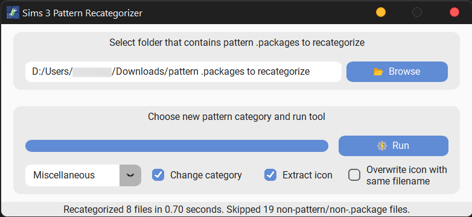
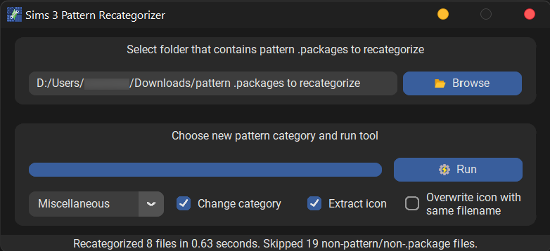

  

<h1 align="center">Sims 3 Pattern Recategorizer</h1>

  
  

Executable file that can recategorize Sims 3 Pattern Custom Content (CC) and extract icons for better CC organization purposes. On 2nd October 2022, this tool was released for public use within the Sims 3 Tumblr community. See the community response [here](https://oxytosim.tumblr.com/post/696994286274805760/sims-3-pattern-recategorizer-s3pr-tool-organize).

## 💡 Motivation ##
This tool is really mostly for my own purposes. I wanted my pattern CC to adhere to more consistent categories. For example, one creator may categorize a floral pattern as *'Fabric'*, while another creator may categorize a different floral pattern as *'Theme'*. To have all floral patterns be the same category in-game, one would have to manually edit the files.

Recategorizing manually for tons of files was soul-sucking. So, I set out to automate the task. Sims 3 .package files are not readable by normal means, so this work would not have been possible without Peter L Jone's [s3pi](http://s3pi.sourceforge.net/) .NET library.

## ✨ Preview ##

    
    
  <h3>🔗 Download the executable <a href="https://github.com/yauyenching/sims-3-pattern-recategorizer/releases/download/v1.1.0.2/Sims3PatternRecategorizer_v1.1.0.2.zip">here</a>!</h3>

## ⭐ Features ##
* [x] Decodes pattern XML and change category at appropriate place
* [x] Extract icon file and save it in same root folder as file
* [x] Executable file
  * [ ] ~~Drag-and-drop capabilities as a mean of loading your files~~
  * [ ] ~~Prompt user to input new pattern category~~
* [X] Simple GUI
  * [X] Set load and save directory file path
  * [X] Set new pattern category
  * [X] Option to toggle saving icon file
  
Upon a test user's request (DEVELOPMENT HALTED UNTIL FURTHER NOTICE):
* [x] Change pattern in another internal XML resource to be more consistent
* [ ] Recategorizes .sims3pack pattern files as well (and not just .package files)
  * Successfully extracted .package from .sims3pack and recategorized that
  * Next step: repackaging into .sims3pack without loss of information
* [ ] Advanced options
  * [ ] Able to change surface material
  * [ ] Able to change pattern description

## 🛠️ Implementation ##
This project was coded using [pythonnet](https://github.com/pythonnet/pythonnet) to utilize .NET libraries in Python, [CustomTkinter](https://github.com/TomSchimansky/CustomTkinter) to create a GUI with a modern interface, and [PyInstaller](https://github.com/pyinstaller/pyinstaller) to create the executable file.

## 🧰 Dependencies ##
Microsoft's [.NET Framework 4](https://www.microsoft.com/en-my/download/details.aspx?id=17851) and the following python packages:
* pythonnet
* beautifulsoup4
* lxml
* customtkinter

The versions used can be found in [requirements.txt](https://github.com/yauyenching/sims-3-pattern-recategorizer/blob/main/requirements.txt).

## ⚙️ Building this Project ##
Install [Python](https://www.python.org/) on your system if you have yet to do so.  Then, run `pip install -r requirements.txt` to install all dependencies.

Then, in the cloned repo, run `python ProgramGUI.py`.

## 📖 Documentation ##
### PatternRecategorizer ###
Class that extracts and modifies resources in .package file and calls on the ResourceChanger class to change pattern category based on user settings.

### ResourceChanger ###
Class that rewrites specific resources within xml type files.

### ProgramGUI ###
Class that forms the main GUI for the program. Produces error messages in the case of invalid run options and then uses a loop to run through each file in the chosen directory.

### Package ###
Wrapper to handle .package files.

### Sims3Pack ###
Handler for .sims3pack files. (Unfinished)

## 🤝🏻 How to Contribute ##
Fork this repository, implement a feature, and open a pull request!

Contributions are very much **welcome**! There are several [features](#-features) that have been
requested by users.

## 📝 License ##
This project is licensed under the GNU GPLv3 License - see the [LICENSE](https://github.com/yauyenching/sims-3-pattern-recategorizer/blob/main/LICENSE) file for details.

## 🙌🏻 Acknowledgements ##
This tool was something I built primarily for my own incredibly niche uses. I found lots of satisfaction in being able to build a standalone desktop application. This project would not have been possible without our forefathers in Sims 3 tool modding: 

* [Anja Knackstedt's Pattern Preset Color Extractor](https://code.google.com/archive/p/pattern-preset-color-extractor/) for building a fabulous tool whose code I heavily referenced for reading .package files and extracting the correct resources for patterns
* [Delphy's Sims 3 Pack Multi-Extracter](https://modthesims.info/d/364038/delphy-s-sims-3-pack-multi-extracter-updated-5th-sept-2009.html) for their useful tool that I referenced when building the UI
* [Peter L Jone's s3pi](http://s3pi.sourceforge.net/) for creating an indispensable library to work with Sims 3 files

Finally, I want to thank the following creators of the assets I used:
* Freepik[[1]](https://www.flaticon.com/free-icon/energy_2990806?term=execute&page=1&position=56&page=1&position=56&related_id=2990806&origin=style)[[2]](https://www.flaticon.com/free-icon/scraps_7096819?related_id=7096819&origin=search)
* [kmg jones](https://www.flaticon.com/free-icon/open-folder_3748664?term=open+folder&page=1&position=3&page=1&position=3&related_id=3748664&origin=style)
* [srip](https://www.flaticon.com/free-icon/double-wrench_1105683?term=wrench&page=1&position=29&page=1&position=29&related_id=1105683&origin=style)

And I got the Sims Plumbob asset from [here](https://wallpapersafari.com/w/Vm27TR).
